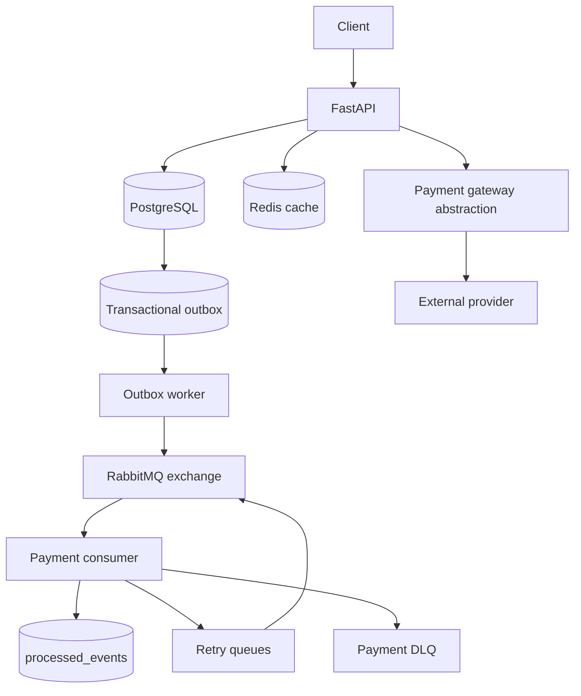

# OrderFlow

OrderFlow is a modular FastAPI order-processing backend built around PostgreSQL, SQLAlchemy, RabbitMQ, Redis, and a transactional outbox.

## Security and failure behavior

- Runtime secrets are loaded from environment variables. `.env` is ignored; `.env.example` is the committed template.
- JWTs use an explicit HS* algorithm, a minimum 32-character signing secret, and an expiration timestamp.
- Passwords are hashed with Argon2 and are never included in response schemas.
- Request schemas reject invalid quantities, prices, IDs, enums, and oversized strings before service execution.
- Payment amounts come from the persisted order. Provider verification determines payment status; client payloads do not.
- Provider webhooks are verified against the exact raw request bytes using the provider signature header before payment processing.
- Webhook signatures use a timestamp tolerance to reject replayed old requests. Provider event IDs are deduplicated in `webhook_events`; internal RabbitMQ deliveries use the separate `processed_events` table.
- Payment idempotency keys are unique. Reusing a key with different payment data returns a conflict.
- Database constraints protect uniqueness, foreign keys, non-null fields, and monetary precision.
- Domain, validation, HTTP, and unexpected errors use a consistent response shape:

```json
{
	"error": "order_not_found",
	"message": "Order not found",
	"request_id": "..."
}
```

Unexpected exceptions are logged with the request ID and return a generic message without a traceback.

Redis is an optimization and readiness dependency, not the source of truth. PostgreSQL remains authoritative when cache data is unavailable.

## Architecture



The system deliberately provides at-least-once event delivery. Consumers acknowledge only after successful processing or a successful retry/DLQ handoff, and `processed_events` prevents duplicate business handling.

## Local setup

1. Copy `.env.example` to `.env` and set a strong `JWT_SECRET_KEY`.
2. Start infrastructure:

```bash
docker compose up -d
docker compose ps
```

Compose healthchecks wait for PostgreSQL, RabbitMQ, and Redis. The one-shot `migrate` service applies Alembic migrations before the API and workers start. Application containers use Docker DNS names (`postgres`, `rabbitmq`, and `redis`) rather than `localhost`; host-side `.env` values are not used for those internal URLs.

Readiness probes are bounded and return `503` with a per-dependency status when Redis or RabbitMQ is unavailable instead of waiting indefinitely. The containerized stack was validated with all services running, Docker DNS resolution, migration completion, API readiness, and Redis/RabbitMQ stop-and-recovery probes.

3. Activate the virtual environment and install dependencies:

```bash
source venv/bin/activate
pip install -r requirements-dev.txt
```

4. Apply migrations:

```bash
alembic upgrade head
```

5. Start the API and workers in separate terminals:

```bash
uvicorn app.main:app --reload
python -m app.workers.outbox_worker
python -m app.workers.payment_consumer
```

The API is available at `http://localhost:8000`. Swagger UI is at `/docs`.

## Tests

Run the complete suite:

```bash
pytest -q
```

The suite covers authentication, RBAC, products, inventory invariants, PostgreSQL row-lock concurrency, orders, payment idempotency, payment compensation, webhook duplication, transactional outbox behavior, consumer deduplication, retries, DLQ handoff, Redis behavior, health checks, and request IDs.

## Load tests

Locust scenarios live in `tests/load/locustfile.py`. They authenticate through the API and read their IDs and credentials from environment variables.

Inventory reservation scenario:

```bash
LOAD_SCENARIO=inventory \
LOAD_PRODUCT_ID=123 \
LOAD_TEST_EMAIL=loadtest-admin@example.com \
LOAD_TEST_PASSWORD='test-password-from-environment' \
LOAD_RESERVATION_QUANTITY=3 \
locust -f tests/load/locustfile.py InventoryReservationUser \
	--headless -u 50 -r 50 -t 30s --host http://localhost:8000
```

Payment idempotency scenario:

```bash
LOAD_SCENARIO=payment \
LOAD_ORDER_ID=456 \
LOAD_IDEMPOTENCY_KEY='unique-load-test-key' \
locust -f tests/load/locustfile.py PaymentIdempotencyUser \
	--headless -u 100 -r 100 -t 30s --host http://localhost:8000
```

At shutdown, each scenario queries PostgreSQL. Inventory must satisfy `reserved_quantity <= quantity`; payment idempotency must leave exactly one row for the shared key.

Verified locally against four API workers: 50 reservation users reached 33 successful reservations and a final `reserved_quantity=99` from `quantity=100`; 100 payment users produced 1,718 successful same-key requests and exactly one payment row. Outbox throughput and duplicate-consumer throughput remain separate messaging load scenarios because they run outside the HTTP request path.

Messaging load results: 1,000 committed outbox events were published with `pending=0` at approximately 244.69 events/second. A consumer run with 2,000 deliveries, including duplicates, produced 1,000 handler effects and 1,000 `processed_events` rows. A broker recovery run left events unpublished while RabbitMQ was unavailable and drained them to `remaining_unpublished=0` after RabbitMQ recovered.

## Event flow

Payment and order state changes create outbox rows in the same database transaction. The outbox worker publishes unpublished rows to the durable `orderflow.events` exchange and marks them published only after successful broker publication. Consumers use `processed_events` for idempotency. Failed messages are retried with a bounded delay and then sent to the payment DLQ.

Delivery is at least once. Consumers must remain idempotent.

## Provider webhooks

The webhook route reads the raw body and delegates verification to the injected `ProviderWebhookVerifier`. The current adapter is `StripeStyleWebhookVerifier`, which parses `Stripe-Signature`, validates the timestamp, calculates an HMAC-SHA256 signature over `timestamp + "." + raw_body`, and parses the trusted event only after verification. `WEBHOOK_SECRET` is environment-only.

The provider event ID is recorded before the request completes. A repeated provider event returns the existing payment without repeating the business transition. This boundary is intentionally separate from internal consumer deduplication.

## Health endpoints

- `GET /health/live` checks process liveness.
- `GET /health/ready` checks PostgreSQL, RabbitMQ, and Redis.

## Containers and CI

`docker-compose.yml` defines PostgreSQL, RabbitMQ, Redis, the migration job, API, outbox worker, and payment consumer. GitHub Actions runs migrations and pytest against PostgreSQL, RabbitMQ, and Redis.
