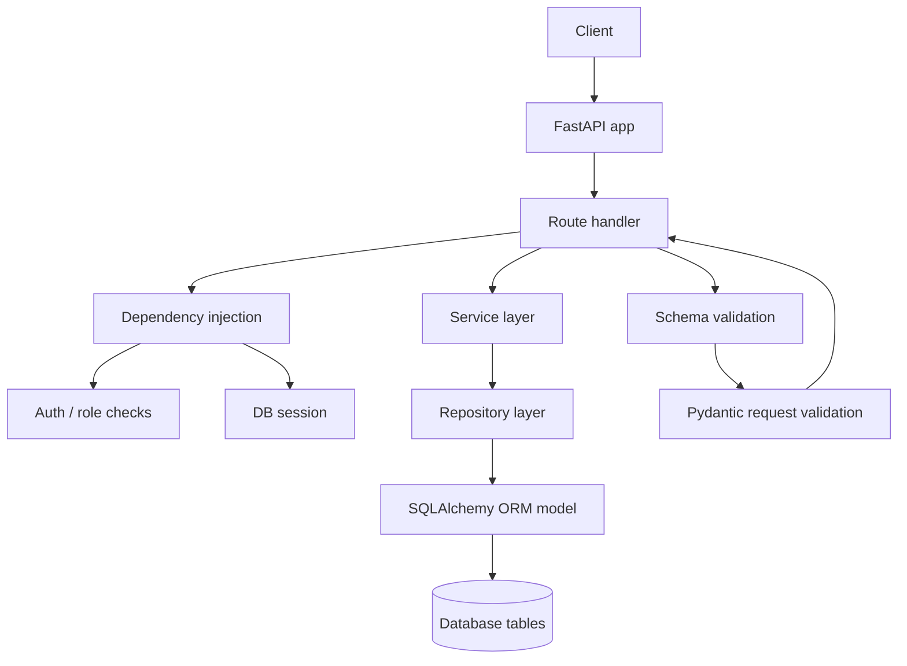

# OrderFlow request flow analysis

This document traces the application from the API routes down to the database layer, showing how an HTTP request moves through the stack and where validations and exceptions are enforced.

## 1. High-level architecture

The application is a FastAPI service with a layered structure:

1. Routes
   - define HTTP endpoints
   - receive request payloads
   - call services
   - translate business exceptions to HTTP responses

2. Dependencies
   - authentication and authorization checks
   - database session injection

3. Services
   - contain business logic
   - enforce domain rules
   - coordinate repositories

4. Repositories
   - wrap database access with SQLAlchemy queries
   - expose CRUD-style operations

5. Models
   - define ORM mappings to database tables

6. Database
   - PostgreSQL via SQLAlchemy engine
   - schema created/managed with Alembic migrations

---

## 2. Request path diagram



### Route-by-route flow

```mermaid
flowchart LR
    A[POST /auth/register] --> B[auth route]
    B --> C[create_user service]
    C --> D[UserRepository-like SQLAlchemy query]
    D --> E[users table]

    A2[POST /auth/login] --> B2[auth route]
    B2 --> C2[authenticate_user service]
    C2 --> D2[users table lookup]
    D2 --> E2[JWT token creation]

    A3[POST /products] --> B3[products route]
    B3 --> C3[ProductService]
    C3 --> D3[ProductRepository]
    D3 --> E3[products table]

    A4[POST /inventory] --> B4[inventory route]
    B4 --> C4[InventoryService]
    C4 --> D4[ProductRepository + InventoryRepository]
    D4 --> E4[products + inventory tables]

    A5[POST /inventory/{id}/add-stock] --> B5[inventory route]
    B5 --> C5[InventoryService.add_stock]
    C5 --> D5[InventoryRepository]
    D5 --> E5[inventory table]

    A6[POST /order] --> B6[order route]
    B6 --> C6[OrderService.create_order]
    C6 --> D6[OrderRepository + OrderItemRepository + ProductRepository + InventoryRepository]
    D6 --> E6[orders + order_items + products + inventory tables]
```

---

## 3. Application startup and router registration

### Main entry point

File: app/main.py

The FastAPI app is created in app/main.py and includes these routers:

- auth router
- user router
- product router
- inventory router

Important observation:
- The order router exists in app/api/v1/routes/order.py but is not registered in app/main.py.
- That means the order endpoint is not currently reachable through the main app unless it is added manually.

### Health endpoint

- GET /
- returns a simple JSON payload: {"status": "ok"}

---

## 4. Route layer

### 4.1 Auth routes

File: app/api/v1/routes/auth.py

Endpoints:

- POST /auth/register
  - accepts UserCreate
  - calls create_user(db, user_data)
  - returns UserResponse

- POST /auth/login
  - accepts OAuth2PasswordRequestForm
  - calls authenticate_user(db, username, password)
  - creates a JWT access token with create_access_token()
  - returns a token response

#### Request flow

```text
Client
  -> POST /auth/register or /auth/login
  -> FastAPI route
  -> dependency get_db
  -> service function
  -> SQLAlchemy query/commit
  -> response model serialization
```

### 4.2 User routes

File: app/api/v1/routes/users.py

Endpoints:

- GET /users/me
  - uses get_current_user dependency
  - returns the currently authenticated user

- GET /users/admin-test
  - uses required_roles(UserRole.ADMIN)
  - returns a simple admin success message

### 4.3 Product routes

File: app/api/v1/routes/products.py

Endpoint:

- POST /products
  - accepts ProductCreate
  - checks role via required_roles(UserRole.ADMIN, UserRole.STAFF)
  - calls ProductService.create_product(product)

### 4.4 Inventory routes

File: app/api/v1/routes/inventory.py

Endpoints:

- POST /inventory
  - creates inventory for a product
  - requires ADMIN or STAFF role

- POST /inventory/{product_id}/add-stock
  - adds stock to an inventory record
  - requires ADMIN or STAFF role

- POST /inventory/{product_id}/remove-stock
  - removes stock from inventory
  - requires ADMIN or STAFF role

- POST /inventory/{product_id}/reserve-stock
  - reserves stock for future use
  - requires ADMIN or STAFF role

- POST /inventory/{product_id}/release-stock
  - releases previously reserved stock
  - requires ADMIN or STAFF role

### 4.5 Order routes

File: app/api/v1/routes/order.py

Endpoint:

- POST /order
  - creates an order for the authenticated user
  - uses get_current_active_user
  - uses OrderService.create_order

Important observation:
- The route file exists, but the route is not mounted in the main app.
- The file also appears to contain a syntax/structure issue in the APIRouter setup, so it is currently not usable as-is.

---

## 5. Dependency layer

### 5.1 Database dependency

File: app/db/session.py

Function:

- get_db()
  - creates a SQLAlchemy SessionLocal session
  - yields it to the route or dependency
  - closes it in a finally block after use

This is the standard dependency injection point for every DB-backed route.

### 5.2 Authentication dependency

File: app/api/dependecies/auth.py

Functions:

- get_current_user(token, db)
  - reads the bearer token
  - decodes the JWT
  - extracts the user id from the token payload
  - fetches the user from the database
  - raises 401 if invalid or missing

- get_current_active_user(current_user)
  - ensures the user is active
  - raises 403 if inactive

- required_roles(*roles)
  - returns a dependency that checks the current user role
  - raises 403 if the user role is not allowed

### 5.3 Token helpers

File: app/core/security.py

Functions:

- hash_password(password)
  - hashes using Argon2

- verify_password(hashed_password, plain_password)
  - verifies password hashes

- create_access_token(subject)
  - creates a JWT with subject = user id and expiration

- decode_access_token(token)
  - decodes and validates JWT

---

## 6. Service layer

### 6.1 User service

File: app/services/user_services.py

Functions:

- create_user(db, user)
  - checks whether an email already exists
  - hashes the password
  - creates a User ORM object
  - commits to the database
  - refreshes the new object
  - raises HTTPException 409 on duplicate email or database integrity failure

- authenticate_user(db, email, password)
  - fetches a user by email
  - checks password validity
  - checks whether the account is active
  - raises 401 for bad credentials and 403 for inactive user

### 6.2 Product service

File: app/services/product_service.py

Function:

- create_product(product_data)
  - checks whether a product with the same SKU already exists
  - creates a Product ORM object
  - persists it through the repository

### 6.3 Inventory service

File: app/services/inventory_service.py

Functions:

- create_inventory(data)
  - checks whether the product exists
  - checks whether inventory already exists for that product
  - creates a new Inventory ORM object

- add_stock(product_id, quantity)
  - loads inventory by product id
  - raises InventoryNotFoundException if missing
  - increases inventory.quantity

- remove_stock(product_id, quantity)
  - verifies inventory exists
  - checks available quantity before removing
  - raises InsufficentStockException if not enough stock is available

- reserve_stock(product_id, quantity)
  - verifies inventory exists
  - checks available quantity before reservation
  - increments reserved_quantity

- release_stock(product_id, quantity)
  - verifies inventory exists
  - checks whether reserved_quantity is sufficient
  - decrements reserved_quantity

### 6.4 Order service

File: app/services/order_service.py

Function:

- create_order(user_id, data)
  - starts a database transaction block
  - creates an Order record with PENDING status
  - iterates through each order item
  - validates each product exists
  - validates inventory exists
  - validates enough stock is reserved/available
  - reserves stock for each item
  - creates OrderItem rows
  - computes total amount
  - commits and returns the created order

---

## 7. Repository layer

### 7.1 Product repository

File: app/repositories/product_repository.py

Functions:

- create(product)
- get_by_id(product_id)
- get_by_sku(sku)
- get_all()
- deactivate(product)

### 7.2 Inventory repository

File: app/repositories/inventory_repository.py

Functions:

- create(inventory)
- get_by_product_id(product_id)
- update(inventory)
- get_by_id(inventory_id)

### 7.3 Order repository

File: app/repositories/order_repository.py

Functions:

- create(order)
- get_by_id(order_id)

### 7.4 Order item repository

File: app/repositories/order_item_repository.py

Functions:

- create(item)

---

## 8. Schema validation layer

The request body and response models are defined in the schemas package.

### 8.1 User schema

File: app/schemas/user.py

- UserCreate
  - email: must be a valid email address
  - password: minimum length 8, maximum 128
  - fullname: minimum length 1, maximum 100

- UserResponse
  - response DTO for user details

### 8.2 Product schema

File: app/schemas/product.py

- ProductCreate
  - sku: length 3 to 50
  - name: length 2 to 200
  - description: length 5 to 1000
  - price: must be greater than 0
  - category: length 2 to 100

### 8.3 Inventory schema

File: app/schemas/inventory.py

- InventoryCreate
  - product_id: integer
  - quantity: must be greater than or equal to 0

- StockOperation
  - quantity: must be greater than 0

### 8.4 Order schema

File: app/schemas/order.py

- OrderItemCreate
  - product_id: integer
  - quantity: must be greater than 0

- OrderCreate
  - items: list of order items

Validation behavior:
- FastAPI uses these Pydantic models automatically.
- If validation fails, FastAPI returns HTTP 422 Unprocessable Entity.

---

## 9. Exception handling and business rules

### 9.1 Custom exceptions

File: app/core/exception.py

Custom exceptions:

- OrderFlowException
  - base exception for the app

- ProductNotFoundException
  - raised when a product does not exist

- InventoryNotFoundException
  - raised when inventory is missing

- InventoryAlreadyexistsException
  - raised when inventory already exists for a product

- InsufficentStockException
  - raised when stock or available quantity is insufficient

- InvalidReservationException
  - raised when release request exceeds reserved quantity

### 9.2 Auth and HTTP exceptions

These are raised directly by dependencies and services:

- HTTPException 401 Unauthorized
  - invalid or expired JWT
  - invalid token payload
  - no user found for the token

- HTTPException 403 Forbidden
  - inactive user
  - insufficient role permissions

- HTTPException 409 Conflict
  - duplicate email during registration

- HTTPException 400 Bad Request
  - bad stock operation or other invalid domain action

- HTTPException 404 Not Found
  - missing product or inventory

### 9.3 Important implementation mismatches

The current code has a few inconsistencies between the intended HTTP behavior and the actual exception handling:

1. Product creation route catches ValueError, but ProductService raises ProductNotFoundException.
2. Inventory routes catch ValueError for create/add/remove operations, but the service layer raises custom exceptions such as InventoryNotFoundException and InsufficentStockException.
3. The order route is not registered in the main app.
4. The order route file appears to have a malformed APIRouter declaration and would need fixing before it can work.

---

## 10. ORM models and database mapping

### 10.1 User model

Table: users

Fields:
- id
- email
- hashed_password
- full_name
- role
- is_active
- created_at
- updated_at

Relationships:
- one user has many orders

### 10.2 Product model

Table: products

Fields:
- id
- sku
- name
- description
- price
- category
- is_active
- created_at
- updated_at

Relationships:
- one product has one inventory record
- one product can appear in many order items

### 10.3 Inventory model

Table: inventory

Fields:
- id
- product_id
- quantity
- reserved_quantity
- created_at
- updated_at

Derived property:
- available_quantity = quantity - reserved_quantity

### 10.4 Order model

Table: orders

Fields:
- id
- user_id
- total_amount
- status
- created_at
- updated_at

Relationships:
- one order belongs to one user
- one order has many order items

### 10.5 Order item model

Table: order_items

Fields:
- id
- order_id
- product_id
- quantity
- unit_price

---

## 11. Database migrations and schema evolution

Alembic migrations define the database schema:

- 26a19d006580_create_users_table.py
  - creates users table

- 4dd85d57b797_add_user_role.py
  - adds the user role enum and column

- 6b705143fadb_create_products_table.py
  - creates products table

- f9ae485c5af4_create_inventory_table.py
  - creates inventory table with product_id foreign key and unique constraint

- c271a15199a2_create_orders_tables.py
  - creates orders and order_items tables with foreign keys

These migrations show the intended relational model:

```text
users 1 --- many orders
products 1 --- 1 inventory
orders 1 --- many order_items
products 1 --- many order_items
```

---

## 12. End-to-end example: creating an order

Here is the full path for a typical order request:

```text
Client sends POST /order
  -> auth dependency validates JWT
  -> route creates OrderService
  -> OrderService creates an Order row
  -> loop through items
       -> ProductRepository checks product existence
       -> InventoryRepository checks inventory existence
       -> InventoryService-style rule checks availability
       -> Inventory reserved_quantity is updated
       -> OrderItemRepository creates order_items rows
  -> total amount is computed
  -> order is refreshed and returned
```

The database writes happen through the repository layer and the SQLAlchemy session.

---

## 13. Summary

The application is organized around a clean route-service-repository pattern, but several parts are currently inconsistent or incomplete:

- authentication and role-based access are implemented
- product, inventory, and user flows are wired through services and repositories
- order flow exists in code but is not fully wired into the app entry point
- exception handling should be standardized to match the service layer and the intended HTTP status codes
- schema validation is handled by FastAPI/Pydantic before the business logic runs

This makes the project a good example of layered API architecture, but it still needs a small round of cleanup to make all paths fully consistent and production-ready.
